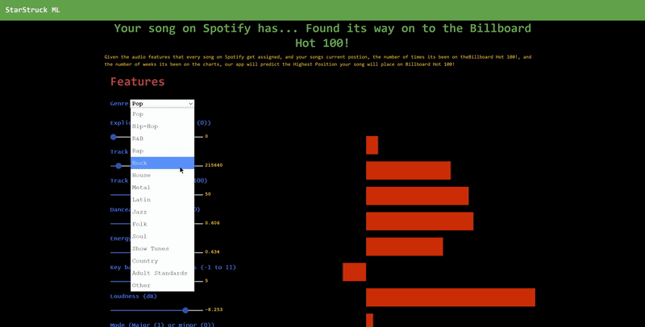
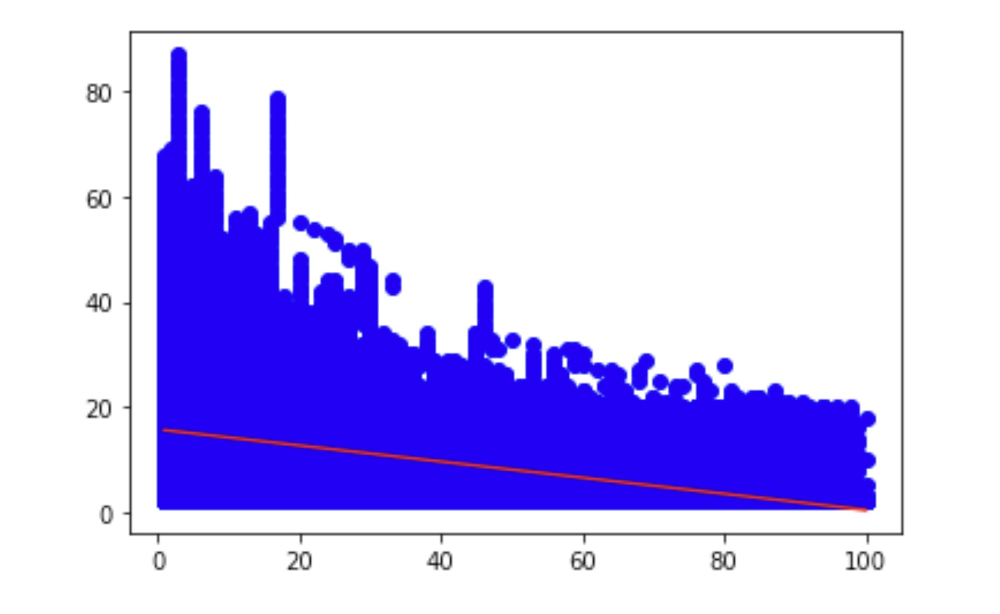
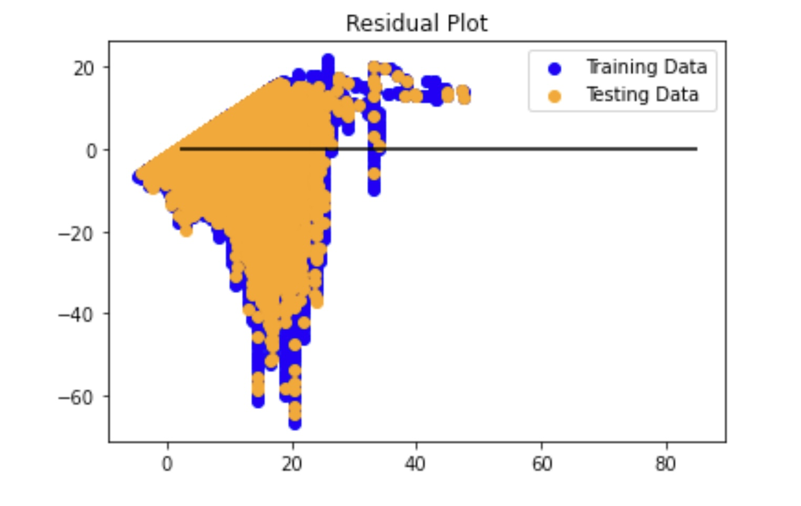

# StarStruck

This project was completed by [Tameka](https://github.com/tkuar), [Miguel](https://github.com/msflores10307) and [Abla](https://github.com/Abla-Beatrice).

StarStruck Web App
 
<a href="https://msflores10307-starstruck-ml.herokuapp.com/"><strong>
Link</strong></a>
 

### Technologies Used
* Python
* Pandas
* HTML/CSS
* JavaScript
* Heroku

## Analyzing and Predicting Songs

## Inspiration
If there’s one thing we can’t live without, it’s Music. We love music and getting lost in it. In the current study, we approached the Hit Song Science problem, aiming to predict which songs will become Billboard Hot 100 hits. We collated a dataset of approximately
**20000 hit and non-hit songs** and extracted each songs audio
features from the **Spotify Web API**. We were able to predict
the Billboard success of a song with approximately 90%
accuracy on the validation set, using two machine-learning
algorithms. The most successful algorithms was Neural Network. We also used unsupervised approach

## Goals
* Using a combinaison of **Features** from Billborad chart and spotify data to estimate **Peak Position** on the Billboard chart.

* Approaching this problem both supervised and unsupervised methods.

## Dataset and Features

1. Acousticness - The higher the value the more acoustic the song is.

2. Danceability — The higher the value, the easier it is to dance to this song.

3. Duration -  The duration of the track in milliseconds.

4. Energy — The energy of a song represent a perceptual measure of intensity and activity. Typically, energetic tracks feel fast, loud and noisy.

5. Instrumentalness - Predicts whether a track contains no vocals. "Ooh" and "Aah" sounds are treated as instrumental in this context.

6. Liveness - Detects the presence of an audience in the recording. Higher liveness values represent an increased probability that the track was performed live. 

7. Loudness — Loudness values are averaged across the entire track and are useful for comparing relative loudness of tracks. Loudness is the quality of a sound that is the primay psychological correlate of physical strengh(amplitude).

8. Mode - Indicates the modality(major or minor) of a track, the type of scale from which its melodic content is derived. 

9. Speechiness - Detects the presence of spoken words in a track.

10. Tempo - The overall estimated tempo of track in beats per minute(BPM). In musical terminoligy, tempo is the speed or pace of a given piece and derives directly from the average beat duration.

11. Time_Signature - An estimated overall time signature of a track. The time signature is a notational convention to specify how may beats are in each bar.

12. Valence — The higher the value, the more positive mood for the song.

## Exploratory Data Analysis

As a part of machine learning model building process, we must get familiar with our data. For this purpose, we will perform data exploration through visualizing various attributes present in the dataset. 

### Simple Linear Regression
- X = Peak Position
- Y = Weeks on Chart

### Multiple Linear Regression

## Predictive Model

Supervised learning, classification algorithms using audio features to predict genre. The models used are: ***Neural Network*** , and ***Random Forest***.
During training, these models analyzed a variety of song features.

## Conclusion

We learned how we can predict which songs users will like based on the playlist listed on Spotify with the help of the Machine Learning Classifier. 

The analysis showed that ***Neural Network*** yielded the highest accuracy, precision and recall of the algorithms tested.
***Random Forest*** suffered from overfitting. We would like
to use more data to reduce the variability of results. Instead of using almost 30000 songs, we hope to include all Spotify Data taken from a longer time period, and a similar number of non-hits from the MSD. Furthermore,
we would like to look into additional audio features, such
as duration, which was not included in this project but has
the potential to predict a songs Billboard success.
